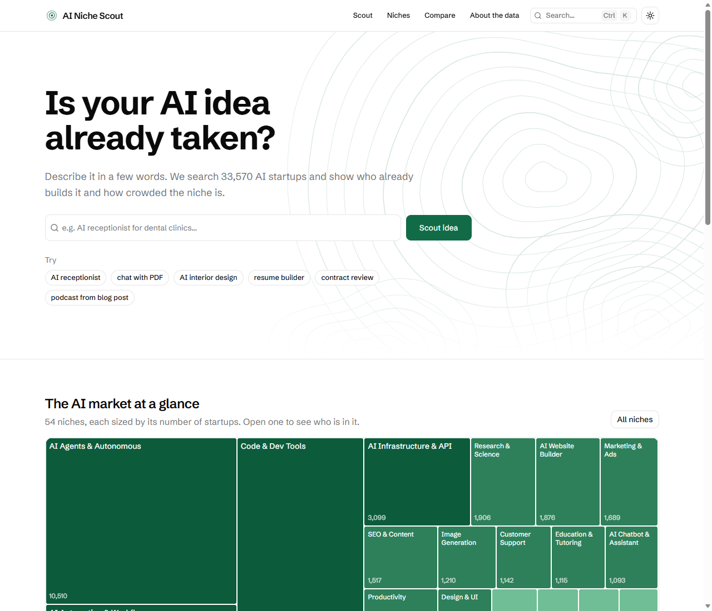
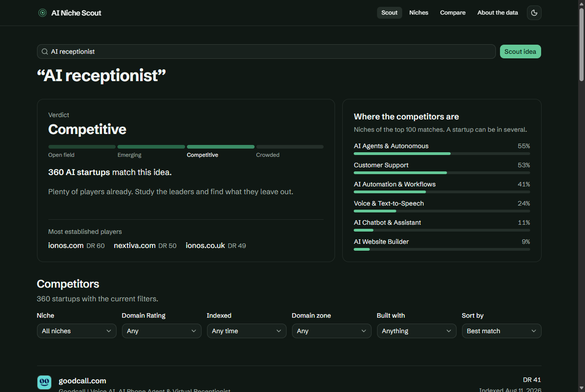

# AI Niche Scout

**Is your AI idea already taken?** Describe an AI product idea and see who already builds it, how crowded the niche is, and what the whole AI startup market looks like. Built on the [FreeSerp](https://freeserp.ai) sites index (`index=sites`, AI niche).

- **Demo:** _Vercel link will be added after deploy_
- **Site plan:** [PLAN.md](PLAN.md) covers the goal, audience, pages and structure.
- **Stack:** Next.js 16 (App Router) · TypeScript · Tailwind v4 · shadcn/ui

| Light: home and AI market map | Dark: idea verdict and competitors |
|---|---|
|  |  |

## What it does

| Page | What you get |
|---|---|
| `/` | Idea search, a treemap of all 54 AI niches sized by startup count, and recently indexed startups |
| `/scout?q=…` | A verdict on the idea (Open field, Emerging, Competitive or Crowded), where the competitors cluster by niche, the most established players, and the full competitor list with 6 filters, sorting and pagination |
| `/niches` | The market map and a ranked table of all niches |
| `/niche/[slug]` | 54 pre-rendered niche pages: size, rank, share, top site, leaders by Domain Rating, newest arrivals, niches of a similar size |
| `/site/[domain]` | A startup profile with similar startups |
| `/compare?d=a,b,c` | Up to three startups side by side. The link is shareable |
| `/about` | Data source, how verdicts are calculated, known limits |

Other details:

- **Light, dark and system themes**, without a flash on load.
- **Every view lives in the URL**, so any state can be shared: filters, sort, page and the compare selection.
- **SEO:**
  - per-page metadata and canonical URLs;
  - `sitemap.xml` with all niche pages, and `robots.txt`;
  - JSON-LD `ItemList` on niche pages;
  - `noindex` on endless filter permutations.
- **A short enter animation on navigation:** 200 ms, opacity and transform only. It is skipped on the first load so it never delays the first paint, and turned off when the system asks to reduce motion.

## How it uses the FreeSerp API

All calls go through one typed server-side client, [src/lib/freeserp.ts](src/lib/freeserp.ts). Every request sends `ai_startups=1` to keep only genuine AI products, plus `project=ai-niche-scout` for identification. Responses are cached by Next.js: 1 hour for searches, 24 hours for counts.

| Feature | Request |
|---|---|
| Idea verdict and niche breakdown | `q=<idea>&size=100`. The verdict is based on `total`, the breakdown counts `ai_categories` across the top 100 matches |
| Market map and niche counts | `ai_categories=<niche>&size=1` for each of the 54 niches. The API has no facet endpoint, so counts are fetched in parallel and cached for a day |
| Filters | `ai_categories`, `dr_min`, `from_date`/`to_date`, `tld`, `ai_source`, `sort=went_live\|dr` with `order`, `from`/`size` |
| "Indexed" month filter | One `from_date`/`to_date` count per recent month. Only months that contain data are offered, for example "August 2026 (32,890)" |
| Niche leaders and newest | `ai_categories=<niche>&sort=dr` and `sort=went_live` |
| Startup profile | `q=<domain>`, keeping the exact domain match (there is no domain filter) |
| Similar startups | Same main niche plus the site's own title as the query |

What exploring the data turned up, and how the UI handles it:

- **`went_live` is not a launch date.** It is labelled "Indexed".
- **Most profiles were added in August 2026**, and the newest are from 2026-09-08.
- **About 80% of new startups have no Domain Rating**, so DR is a filter and not the default sort.
- **`first_seen` is 2025-01-01 for every site**, so it is not shown.
- **Search matches all words**, so long descriptions find fewer sites. The verdict panel suggests shortening the query when there are fewer than 20 matches.

## Run locally

Requires Node.js 20.9 or newer.

```bash
npm install
npm run dev          # http://localhost:3000
```

Production build:

```bash
npm run build && npm start
```

No API key or environment variables are needed. The optional `NEXT_PUBLIC_SITE_URL` sets the canonical domain. On Vercel it is detected automatically.

## Quality checks

- `npm run lint` and `npm run build` pass, including the TypeScript check.
- Every route was checked in a real browser (Playwright) in light and dark themes, at desktop width and at a 390px mobile width. The compare flow was tested end to end: add, badge, URL sync, shared link, removal.
- Lighthouse, mobile preset, production build on localhost:

| Page | Performance | Accessibility | Best practices | SEO |
|---|---|---|---|---|
| `/` | 95 | 97 | 100 | 100 |
| `/niche/legal` | 95 | 100 | 100 | 100 |
| `/scout?q=AI receptionist` | 92 | 100 | 100 | 66* |

\* Scout result pages are `noindex` on purpose. The remaining accessibility note on `/` is the small tiles of the smallest niches on the map. Their area is honest by design, and every niche is also reachable from the table on `/niches`.

## How I worked with AI

The project was built with **Claude Code** (Anthropic's coding agent, the same agent as in Claude Desktop's Code tab), running Claude Opus 5.5 in VS Code. The AI setup is committed to the repo, so it can be reviewed and reproduced:

- **[CLAUDE.md](CLAUDE.md):** project rules for the agent. It covers the stack, which skill to use when, the API rules (server-side only, always `ai_startups=1`, never call `went_live` a launch date), conventions, and what "done" means: lint, build, and a check in both themes and at mobile width.
- **[.claude/skills/](.claude/skills/):** project-level skills, chosen deliberately and kept to four:
  - `shadcn`, the official shadcn/ui rules;
  - `vercel-react-best-practices`;
  - `web-design-guidelines`, used as the final UI review;
  - `frontend-design`, for typography and palette.

  I chose not to add large "style database" skills such as ui-ux-pro-max: they would conflict with the shadcn rules.
- **[.mcp.json](.mcp.json):** the shadcn MCP server for searching and adding registry components. It is wrapped with `cmd /c` for Windows.

The process:

1. **Read the API docs and probe the real data** before choosing an idea: niche sizes, data freshness, DR coverage, and how search behaves on natural-language queries. The idea and the verdict thresholds come from those numbers, not from guesses.
2. **Decide the direction with the AI.** The options were a product-grade tool or a flashy landing page. A product-grade tool fits an SEO company and a 2–4 hour budget better. Then write the plan ([PLAN.md](PLAN.md)) before any code.
3. **Build in small, verified steps**, checking every view in a headless browser instead of trusting the code.
4. **Review against the guidelines and Lighthouse, then fix what they found.**

Problems found by verification and fixed along the way:

| Found | Fix |
|---|---|
| A constant imported from a `"use client"` module into a server page arrives as a client reference, not a number | Moved shared values to [src/lib/compare.ts](src/lib/compare.ts) |
| Race between the localStorage provider and the compare page's URL sync: a shared link was overwritten | Rewrote the store with `useSyncExternalStore` |
| SSGOI's packaged Next.js boundary wraps the page in Suspense, so all HTML streamed hidden. LCP was 4.5s and Performance 84 | A manual pathname boundary. LCP 3.0s, Performance 95 |
| SSGOI transitions in Firefox: the incoming page painted text first and the rest later, and the motion felt slow (found by manual testing in Firefox) | Dropped SSGOI and replaced it with a 200 ms CSS enter animation that behaves the same in every browser |
| Favicon 404s in the console and stretched icons | Server-side favicon proxy ([src/app/api/favicon/route.ts](src/app/api/favicon/route.ts)) with a lettered fallback, cached for a day |
| An "Earlier" month option and months with zero results | Month options built from real counts |
| A niche stat that said nothing ("WordPress, 5% of top 100") | Replaced with the top site by DR |

## Not done yet

- **Deploying to Vercel**: next step, the code is ready for it.
- **Automated tests.** Verification was manual in the browser. Unit tests for the treemap, verdict and filter parsing would be the first to add.
- **Cross-browser pass on real devices.** The navigation animation was measured in Chromium. Firefox, Safari and mobile devices still need a manual check.
- **Open Graph images** per niche.

## What I would do next

- **Trends over time** once the index has a longer history: niche growth per month and "heating up" niches.
- **News per startup and niche** from FreeSerp's companion [freenewsapi.ai](https://freenewsapi.ai).
- **Saved scouts and alerts** when a new competitor appears for your idea.
- **Semantic matching** of the idea description (embeddings) instead of keyword matching, so long descriptions are not penalised.
- **A shareable verdict card** (OG image) for each scouted idea.
